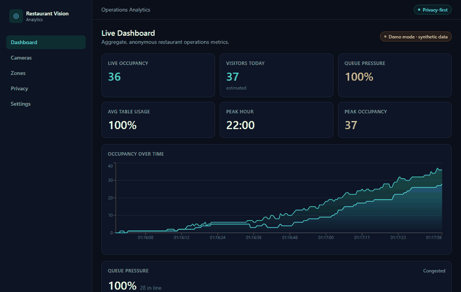
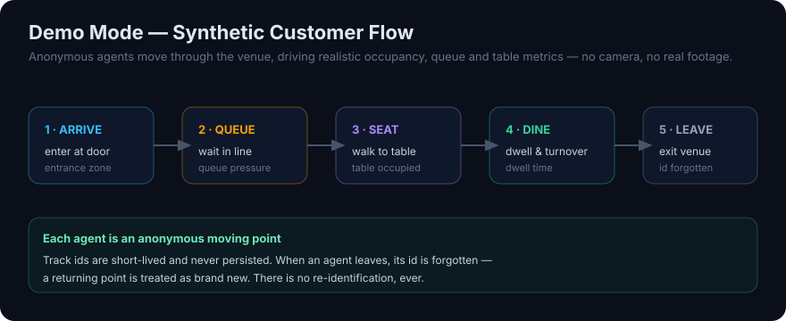
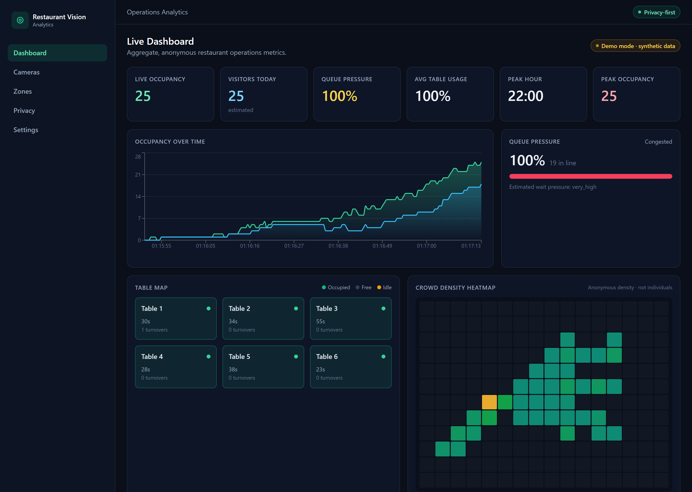
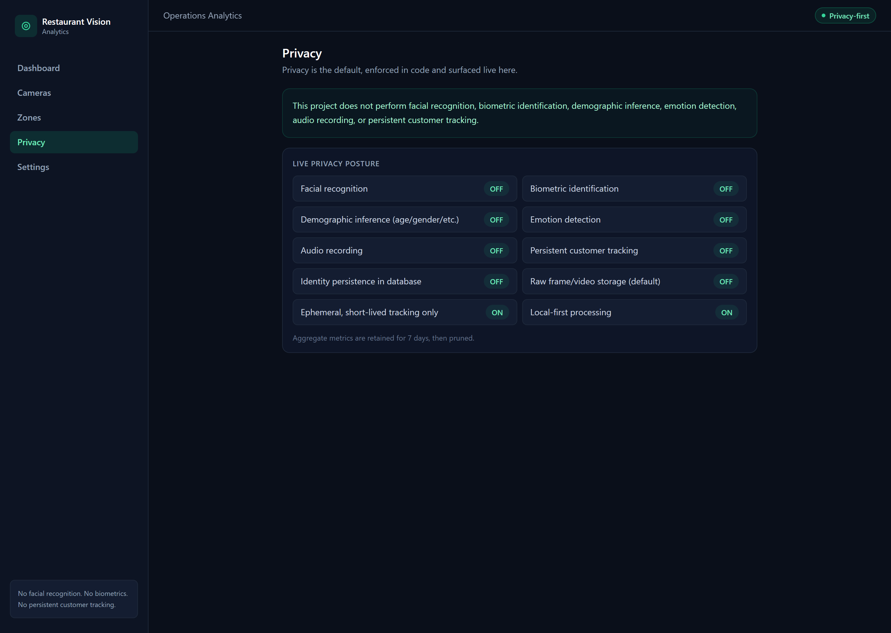
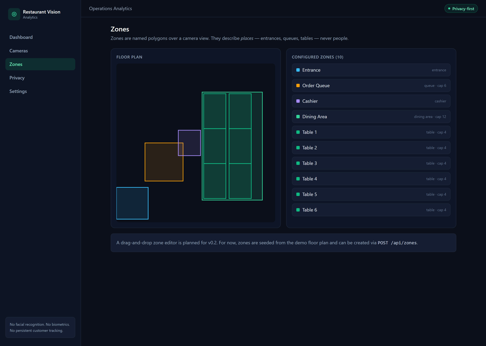
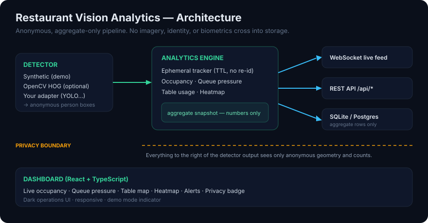
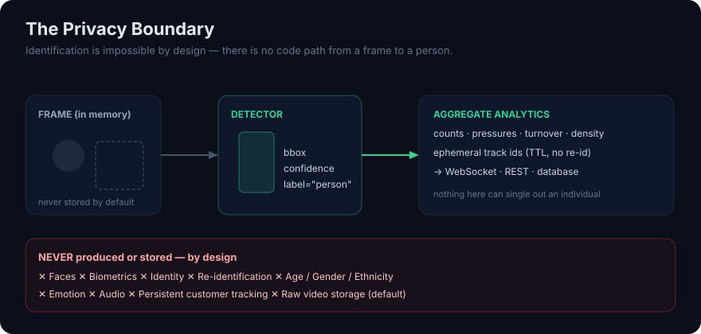

<div align="center">

# 🍽️ Restaurant Vision Analytics

### Privacy-first open-source computer vision toolkit for restaurant occupancy, queue monitoring, table usage and customer flow analytics.

[](https://github.com/huseyintkoksal/restaurant-vision-analytics/actions/workflows/backend.yml)
[](https://github.com/huseyintkoksal/restaurant-vision-analytics/actions/workflows/frontend.yml)
[](https://github.com/huseyintkoksal/restaurant-vision-analytics/actions/workflows/docker.yml)
[](LICENSE)
[](PRIVACY.md)
[](pyproject.toml)
[](https://github.com/astral-sh/ruff)

**Anonymous restaurant _operations_ analytics — not surveillance.**



</div>

> [!IMPORTANT]
> **This project does not perform facial recognition, biometric identification,
> demographic inference, emotion detection, audio recording, or persistent
> customer tracking.**

---

## In 20 seconds

Restaurant Vision Analytics turns a ceiling camera (or, out of the box, a
**synthetic demo**) into **anonymous, aggregate** operations metrics: how busy
the room is, how much pressure the queue is under, which tables are occupied and
turning over, and where crowds form. It does this **without identifying anyone** —
identification is made impossible by the architecture, not just switched off.

Run it in one command and watch a live dashboard update with synthetic,
privacy-safe data — no camera required.

## Why this exists

Most "people analytics" tools answer "how does my space flow?" by reaching for
facial recognition and per-person tracking. That is invasive, frequently
unlawful, and — for operations questions — unnecessary. This project takes the
opposite stance: derive genuinely useful operations metrics while keeping every
individual anonymous. The analytics layer only ever receives anonymous geometry
and counts.

## What it does

- 📊 **Occupancy** — anonymous person counts per zone and overall, with peak/average.
- 🧍 **Queue monitoring** — queue pressure score and status (clear → congested).
- 🍽️ **Table usage** — occupied/free, dwell time, turnover, idle-table detection.
- 🔥 **Heatmaps** — coarse, anonymous crowd-density grid (where crowds form, not who).
- 🔔 **Alerts** — long queue, idle table, camera offline, occupancy threshold.
- ⚡ **Live dashboard** — real-time updates over WebSocket, dark operations UI.
- 🧪 **Demo mode** — a synthetic detector drives the whole stack with **no camera**.

## What this project does NOT do

- No facial recognition
- No biometric identification
- No demographic inference
- No emotion detection
- No audio recording
- No persistent customer tracking
- No raw video storage by default

These are not just disabled toggles — there is **no code path** from a frame to
an identity, and a [privacy regression test](backend/tests/test_privacy_no_identity_persistence.py)
fails CI if anyone tries to add one. See [PRIVACY.md](PRIVACY.md).

## Features

| Area | What you get |
| --- | --- |
| Backend | FastAPI + Uvicorn, SQLModel, SQLite (Postgres optional), WebSocket live feed |
| Vision | Pluggable `Detector` interface, ephemeral centroid tracker, zone engine, frame sources |
| Analytics | Occupancy, queue pressure, table usage, heatmap, alerts |
| Frontend | React + TypeScript + Vite + Tailwind, Recharts, responsive dark dashboard |
| Privacy | Anonymous-by-design, raw-frame storage off by default, configurable retention |
| DX | Docker Compose, Makefile, tests, CI, typed API client, audit scripts |

## Quick start

```bash
git clone https://github.com/huseyintkoksal/restaurant-vision-analytics.git
cd restaurant-vision-analytics
cp .env.example .env

# Backend
python -m venv .venv && source .venv/bin/activate   # Windows: .venv\Scripts\activate
pip install -e ".[dev]"
uvicorn app.main:app --reload --app-dir backend      # http://localhost:8000

# Frontend (second terminal)
cd frontend && npm install && npm run dev            # http://localhost:5173
```

Open **http://localhost:5173** and the dashboard comes alive with synthetic data.

## Docker quick start

```bash
docker compose up --build
# backend  -> http://localhost:8000
# frontend -> http://localhost:5173
```

See [docs/Docker.md](docs/Docker.md).

## Manual setup

With the Makefile (Linux/macOS, or Git Bash/WSL on Windows):

```bash
make install     # backend (editable, with dev extras) + frontend deps
make demo        # backend in demo mode on :8000
make frontend    # Vite dev server on :5173
make test        # backend test suite
```

On Windows **without** `make`, run the underlying commands directly — see
[docs/GettingStarted.md](docs/GettingStarted.md).

## Demo mode

Demo mode is **on by default**. A `SyntheticDetector` simulates anonymous
customer flow — agents arrive, queue, sit, and leave — so every panel comes
alive with no camera and no real footage. Tune intensity with `DEMO_ARRIVAL_RATE`
or generate a static timeline; see [docs/DemoMode.md](docs/DemoMode.md).



## API preview

```bash
curl http://localhost:8000/api/analytics/live
```

```json
{
  "timestamp": "2026-01-01T12:00:00Z",
  "camera_id": "demo-camera-1",
  "occupancy": { "total": 18, "by_zone": { "entrance": 2, "queue": 5, "dining_area": 11 } },
  "queue": { "count": 5, "pressure_score": 0.72, "status": "busy" },
  "tables": [{ "zone_id": "table-1", "occupied": true, "duration_seconds": 1320 }],
  "privacy": { "identity_tracking": false, "biometrics": false, "raw_frame_storage": false }
}
```

Endpoints: `/health`, `/api/cameras`, `/api/zones`, `/api/analytics/*`,
`/api/alerts`, `/api/privacy`, and `WS /ws/analytics`. Full reference in
[docs/API.md](docs/API.md).

## Dashboard preview

| Live dashboard | Privacy posture | Zones |
| --- | --- | --- |
|  |  |  |

_Screenshots above are generated from demo mode (synthetic, anonymous data)._

## Architecture preview



A pluggable detector emits anonymous boxes; the analytics engine turns them into
aggregate snapshots; only numbers cross into the WebSocket, REST API, and
database. Details in [docs/Architecture.md](docs/Architecture.md).

## Privacy-first design



- **No biometrics, no identities** — detections are anonymous boxes only.
- **Ephemeral tracking** — short-lived ids, a TTL, and *no re-identification*.
- **Aggregate analytics** — only counts and pressures leave the pipeline.
- **Raw frames off by default** — gated behind a single explicit setting.
- **Configurable retention** — aggregate data is pruned after N days.
- **Local-first** — runs fully on-prem with no data leaving the venue.

Read [PRIVACY.md](PRIVACY.md), [docs/PrivacyFirstDesign.md](docs/PrivacyFirstDesign.md),
and the [KVKK/GDPR checklist](docs/KVKK_GDPR_Checklist.md) (not legal advice).

## Use cases

- Staffing the lunch rush from **anonymous** occupancy and queue pressure.
- Improving seating and service with **table turnover** insight.
- Spotting bottlenecks (long queues, idle tables) via alerts.
- Self-hosted, **local-first** analytics that keeps data on-premises.

## Limitations

Restaurant Vision Analytics is an **early open-source toolkit** designed for
privacy-first operational analytics. Be aware:

- **Demo mode uses synthetic data** — it illustrates the pipeline, not your venue.
- **Accuracy depends** on camera angle, lighting, occlusion, detector quality, and
  zone setup. Treat all numbers as operational estimates.
- Real-camera input is **experimental** in v0.1 (see [ROADMAP.md](ROADMAP.md)).
- This is **not a legal compliance product** and **not legal advice**; real
  deployments require local legal/privacy review.
- **No facial recognition or identity tracking by design** — so it cannot (and
  will not) measure a specific person's wait or recognize returning customers.

## Roadmap

`v0.1` demo mode, analytics, dashboard, privacy docs, tests, Docker · `v0.2`
real RTSP cameras, zone editor, Postgres, CSV export · `v0.3` multi-camera,
historical reports, RBAC · `v1.0` stable API, plugin detectors, production guide.
See [ROADMAP.md](ROADMAP.md) and the detailed [v0.2 plan](docs/V02Plan.md).

## Contributing

Contributions are welcome — detector adapters, docs, and dashboard polish —
as long as they keep analytics anonymous and aggregate. Start with
[CONTRIBUTING.md](CONTRIBUTING.md) and our [Code of Conduct](CODE_OF_CONDUCT.md).
Looking for a first task? See the [launch guide](docs/GitHubLaunch.md) for
good-first-issue ideas.

## Security

Found a vulnerability? Please follow [SECURITY.md](SECURITY.md) for responsible
disclosure. Do not open a public issue for security reports.

## License

[MIT](LICENSE). Optional AI model adapters may depend on third-party
model/tool licenses; model weights are **not** included. See
[LICENSES.md](LICENSES.md).

---

<div align="center">

⭐ **If you believe analytics can be useful _and_ privacy-respecting, star & watch the project** — it genuinely helps others find a non-surveillance option.

<sub>Be honest, be transparent, build trust. No bots, no fake stars.</sub>

</div>
